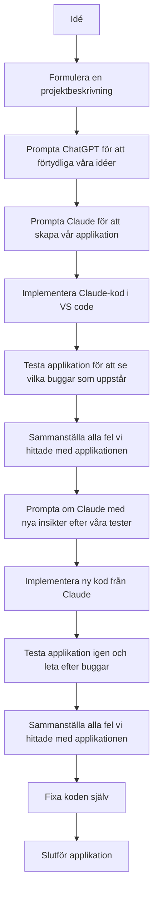
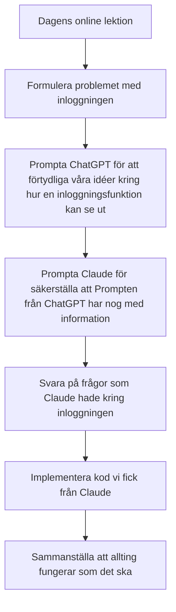

# Utvecklingsprocess – AI-stödd applikation
### 2026-01-20

```mermaid
flowchart TD
    A[Idé] --> B[Formulera en projektbeskrivning];

    B --> C[Prompta ChatGPT för att förtydliga våra idéer];
    C --> D[Prompta Claude för att skapa vår applikation];

    D --> E[Implementera Claude-kod i VS code];
    E --> F[Testa applikation för att se vilka buggar som uppstår];
    F --> G[Sammanställa alla fel vi hittade med applikationen]

    G --> H[Prompta om Claude med nya insikter efter våra tester];
    H --> I[Implementera ny kod från Claude];
    I --> J[Testa applikation igen och leta efter buggar];
    J --> K[Sammanställa alla fel vi hittade med applikationen]

    K --> L[Fixa koden själv];
    L --> M[Slutför applikation];
```

### 2026-01-21

```mermaid
flowchart TD
    A[Dagens online lektion] --> B[Formulera problemet med inloggningen];

    B --> C[Prompta ChatGPT för att förtydliga våra idéer kring hur en inloggningsfunktion kan se ut];
    C --> D[Prompta Claude för säkerställa att Prompten från ChatGPT har nog med information];

    D --> E[Svara på frågor som Claude hade kring inloggningen];
    E --> F[Implementera kod vi fick från Claude];
    F --> G[Sammanställa att allting fungerar som det ska]
```