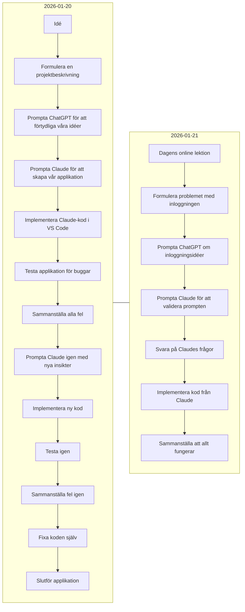

# Utvecklingsprocess – AI-stödd applikation

```mermaid
flowchart LR

subgraph D1[2026-01-20]
    A1[Idé] --> B1[Formulera en projektbeskrivning]
    B1 --> C1[Prompta ChatGPT för att förtydliga våra idéer]
    C1 --> D1b[Prompta Claude för att skapa vår applikation]
    D1b --> E1[Implementera Claude-kod i VS Code]
    E1 --> F1[Testa applikation för buggar]
    F1 --> G1[Sammanställa alla fel]
    G1 --> H1[Prompta Claude igen med nya insikter]
    H1 --> I1[Implementera ny kod]
    I1 --> J1[Testa igen]
    J1 --> K1[Sammanställa fel igen]
    K1 --> L1[Fixa koden själv]
    L1 --> M1[Slutför applikation]
end

subgraph D2[2026-01-21]
    A2[Dagens online lektion] --> B2[Formulera problemet med inloggningen]
    B2 --> C2[Prompta ChatGPT om inloggningsidéer]
    C2 --> D2b[Prompta Claude för att validera prompten]
    D2b --> E2[Svara på Claudes frågor]
    E2 --> F2[Implementera kod från Claude]
    F2 --> G2[Sammanställa att allt fungerar]
end

D1 --- D2
```